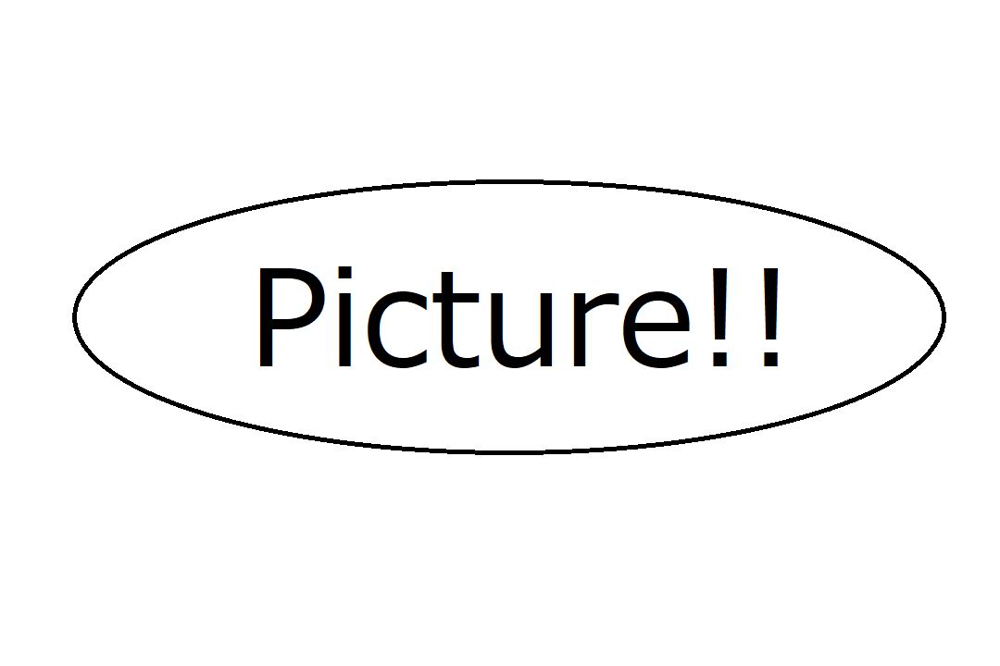

```{r setup, include=FALSE}
knitr::opts_chunk$set(echo = FALSE)
```

## 図

グラフ以外の図を貼り付けたい場合は、
<!--  -->
という記載方法となります

## 図


やはりここでも、図と文章は同じページには保存されません
なので、表と同じ作戦で統一ページに説明文をのせます


## 図と文章

<div class="columns">

<div class="column">


</div>

<div class="column">

これで同じスライド内に文章を表示できました

</div>

</div>


## 図と文章

:::::: {.columns}

::: {.column}


:::

::: {.column}

表とまったく一緒ですね

:::

:::::::::::::

